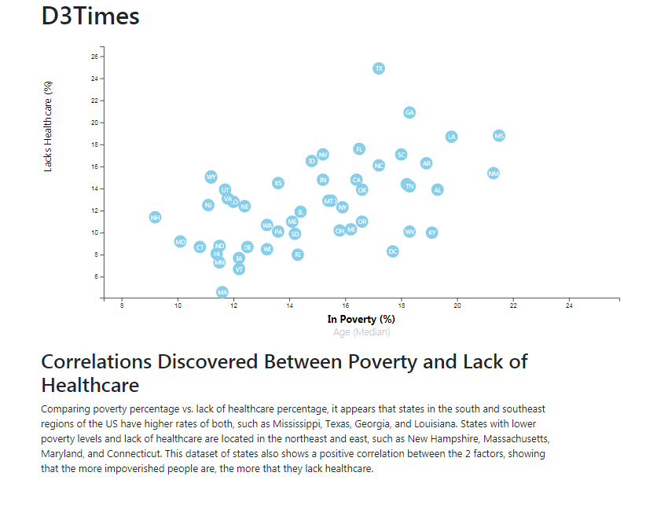

# Project Background

You're tasked with analyzing the current trends shaping people's lives, as well as creating charts, graphs, and interactive elements to help readers understand your findings. The data set included with the assignment is based on 2014 ACS 1-year estimates: https://factfinder.census.gov/faces/nav/jsf/pages/searchresults.xhtml. The current data set incldes data on rates of income, obesity, poverty, etc. by state. MOE stands for "margin of error."

You need to create a scatter plot between two of the data variables such as Healthcare vs. Poverty or Smokers vs. Age.
Using the D3, create a scatter plot that represents each state with circle elements.

* Include state abbreviations in the circles.
* Create and situate your axes and labels to the left and bottom of the chart.

Note: You'll need to use python -m http.server to run the visualization. This will host the page at localhost:8000 in your web browser.

Incorporate d3-tip (Bonus)

Add tooltips to your circles and display each tooltip with the data that the user has selected. Use the d3-tip.js plugin developed by Justin Palmer—we've already included this plugin in your assignment directory.

## Scatter Plot Screenshot

Scatter plot of Poverty vs. Lack of Healthcare

